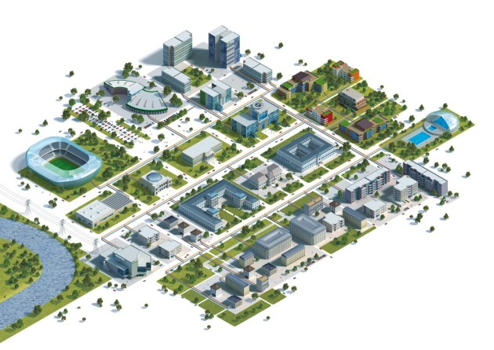
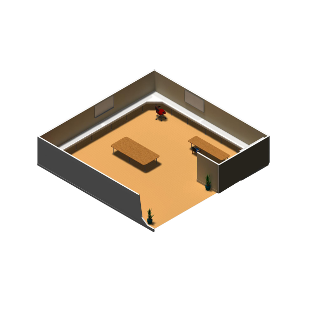
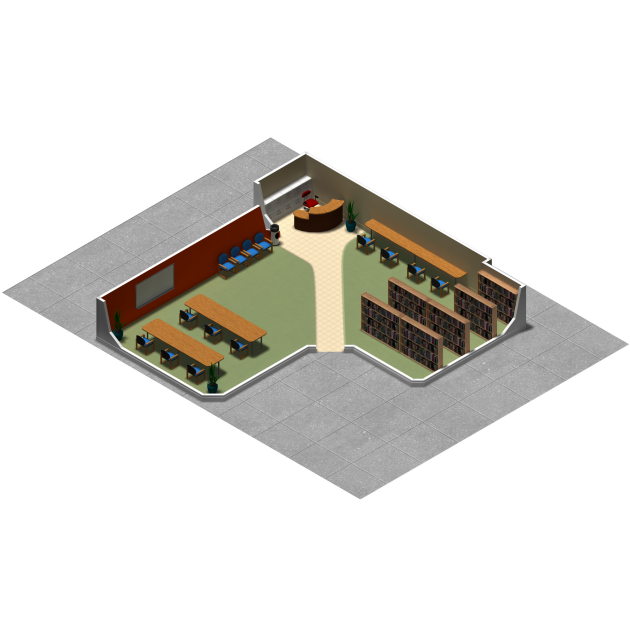
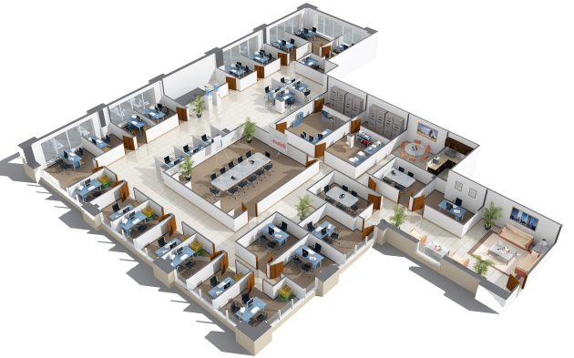
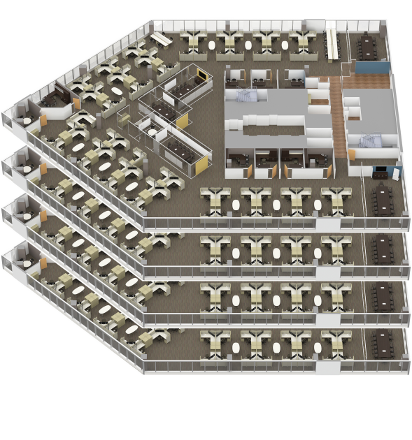
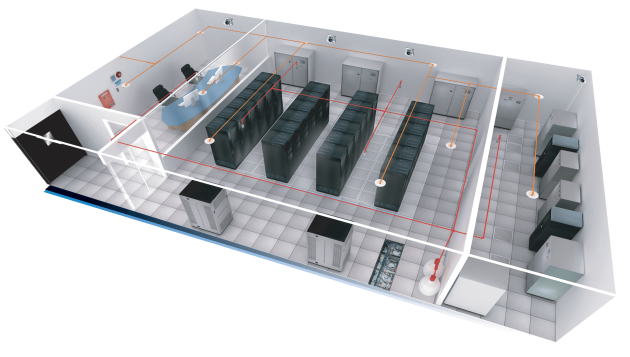

# FunkyTown

## Contexte du projet

Le maire de Funkytown souhaite soutenir une politique numérique auprès des entreprises de la ville. Cette aide arrive au bon moment pour l'ESN eXia qui vient de s'implanter dans la ville. De nombreux contrats ont été décrochés grâce à cette politique de soutien.

Voici les premiers contrats décrochés par l'ESN eXia auxquels vous devrez répondre avant la date indiquée sur le planning de briefing du bloc:

## ENS eXia

L'ESN eXia s'installe, vous devez installer le réseau en suivant ce cahier des charges ci-dessous. Vous partez d'une feuille blanche, à vous de réfléchir à l'architecture réseau de votre entreprise. Des propositions permettant d'améliorer le cahier des charges seront les bienvenues. Les éléments du cahier des charges sont attendus au minimum.

2 PC fixes :
- Adressage fixe dans le réseau 192.168.1.0/24
- Accès au Web
- Résolution avec le DNS du datacenter

1 PC portable :
- Adressage fixe dans le réseau 192.168.1.0
- Accès au Web
- Résolution avec le DNS du datacenter

1 Switch L2 :
- Sécurisation des accès

1 Borne Wifi :
- Sécurité la plus haute pour l'accès au réseau
- Configuration permettant l'accès au Web

1 Routeur :

- Adressage fixe en 192.168.1.254/24
- Sécurisation des accès
- Configuration permettant l'accès au Web

Un serveur DNS & FTP local :

- Adressage fixe en 192.168.1.200/24
- Permet de récupère et déposer des images IOS d'équipements
- Configurer Le serveur DNS pour les postes de l'entreprise

-> Ajouter une entrée DNS www.google.com avec l'ip 108.177.127.139

Câblage :

- Câblage adapté au besoin/charge

## Bibliothèque

Sara est ravie ! La politique d'investissement du maire de FunkyTown permet de débloquer des fonds pour la bibliothèque municipale. Elle va pouvoir avoir du bon matériel pour travailler, bien configuré par vos soins !

1 Routeur :
- Sécurisation de l'accès physique
- Mise en place d'un accès à distance via SSH ou telnet
- Adresse IP statique dans le réseau 192.168.0.0/24
- Configuration du service DHCP en 192.168.0.0/24
- Configuration permettant l'accès web au périphériques internes

5 PC fixes :
- 4 PC à dispositions destinés au libre-service
- 1 PC pour l'assistante de la bibliothèque
- Adressage IP dynamique avec un DNS public
- Accès WEB

1 switch L2
- Sécurisation de l'accès physique
- Mise en place d'un accès à distance via SSH ou telnet

1 Borne Wifi :
- Configuration d'un SSID
- Pas de sécurité pour un accès ouvert au public

2 PC portables :
- Adressage dynamique avec un DNS public
- Accès WEB

## Engie

Le courant passe bien entre le maire et le groupe industriel énergétique Engie. Celui-ci rend de fiers services à la ville de FunkyTown en maintenant son réseau électrique ! En revanche, son réseau informatique laisse à désirer. Le groupe ayant plusieurs équipes, il va falloir segmenter le réseau. A vous de jouer !

2 Switch L2
- Configuration du VTP
- Mise en place de 3 VLANs :
  - VLAN 10 -> Service Technique.
  - VLAN 11 -> Service Commercial
  - VLAN 12 -> Wifi invités

- Avec la technique du VLSM prévoyez un adressage permettant d'accueillir plus de collaborateur dans un avenir proche :
  - VLAN 10 -> 100 collaborateurs
  - VLAN 11 -> 60 collaborateurs
  - VLAN 12 -> 20 collaborateurs

1 Serveur DHCP & DNS :

- Adressage IP statique dans une plage réseau ne permettant que 2 adresses. Ajoutez cette plage à la suite de la plage du VLAN 12
- Configuration des pools DHCP correspondant aux VLAN
- Ce serveur servira de DNS pour les postes de l'entreprise

1 Routeur :
- Sécurisation de l'accès physique
- Mise en place d'un accès à distance via SSH
- Mise en place du routage inter-vlan
- Accès WEB pour les périphériques internes

2 Bornes Wifi :
- Configurer un SSID sur chacune des bornes
- Pas de sécurité pour un accès public
- Configurer les Bornes dans le vlan 12

25 PC fixes :
- Configurer les PC jaune dans le VLAN 10
- Configurer les PC orange dans le VLAN 11
- Adressage IP Dynamique
- Accès WEB

4 PC portables :
- Configurer les PC bleu sur le Wifi dans le VLAN 12
- Adressage IP dynamique
- Accès WEB

2 téléphones portables :
- Configurer les téléphones sur le Wifi publique
- Adressage IP dynamique
- Accès WEB

## Digiplex

Digiplex propose des solutions numériques tout en préservant l'environnement. Pas facile d'être une entreprise rentable en respectant ses valeurs et un prix juste pour les clients. L'aide de la ville est vécu comme une opportunité par l'entreprise ! Aidez Digiplex à se développer durablement !

Etherchannel :

- Configuration des liaisons entre switch de chaque Etage avec le protocole de votre choix.

Création des VLAN (en fonction des couleurs) avec le VTP :

- Vlan 10 : nom « Conception » en 192.168.10.0/24
- Vlan 20 : nom « Commercial » en 192.168.20.0/24
- Vlan 30 : nom « Ressources_Humaine » en 192.168.30.0/24
- Vlan 40 : nom « Hotline » en 192.168.40.0/24
- Vlan 50 : nom « Wifi_Enterprise » en 192.168.50.0/24
- VLAN 60 : nom « Wifi_invités » en 192.168.60.0/24
- Vlan 70 : nom « Server » en 192.168.70.0/24
- Vlan 80 : nom « Management » en 192.168.80.0/24

Mise en place du routage Inter-vlan :

- Attribuer l'ensemble des PC fixes dans leur vlan
- Appliquer le routage inter-vlan sur le switch L3, chaque interface aura la dernière IP du réseau
- Des IPs statiques sont déjà attribuées aux serveurs
- Configurer les pools DHCP sur le serveur DHCP

-> L'option DNS sera l'adresse IP du serveur de l'entreprise 192.168.70.3
- Attribuer des adresses IP dynamiques sur l'ensemble des postes clients

Conception Wifi :
- Configurer le contrôleur Wifi en mode trunk avec un vlan natif 70
- Configurer les bornes Wifi en mode trunk avec un vlan 70

Configurez 2 SSID sur le contrôleur Wifi

-> Wifi entreprise avec le vlan 50 avec une clé WPA2

-> Wifi invités avec le vlan 60
- Connectez chaque PC portable en Wifi selon le VLAN respectif
- Chaque PC sera configuré avec une IP dynamique

Configuration du Vlan de management :
- Chaque switch doit être accessible via SSH ou telnet
- Chaque switch sera configuré avec une IP statique dans le réseau 192.168.80.0/24

Routeur :
- Chaque PC (Fixe et laptop) doit avoir avec un accès WEB

## Datacenter

eXia a maintenant un portefeuille de clients intéressants. Bien joué ! Elle souhaite faire évoluer son offre et a investi dans un serveur Meraki qu'elle a choisi d'héberger dans le cloud. Le but premier de ce serveur sera de centraliser la configuration des routeurs clients Meraki que l'entreprise déploiera par la suite chez ses futurs clients.

Ce serveur est accessible par son IPv6 : 2001:DB8:1000::1/64

A vous de connecter votre bureau au cloud.

Interconnexion IPv6 avec le Cloud :

- Configuration du réseau local de l'entreprise EXIA en 2001:DB8:2000::/64
- Création d'un tunnel IPv6 entre le routeur cloud et le routeur de votre bureau

-> Le tunnel aura pour adresse réseau : 2001:DB8:3000::/64
- Le réseau du cloud distant est déjà configuré en 2001 :DB8 :1000 ::/64

Les PC du bureau doivent pouvoir afficher la page d'administration du Serveur Meraki avec son IP !
